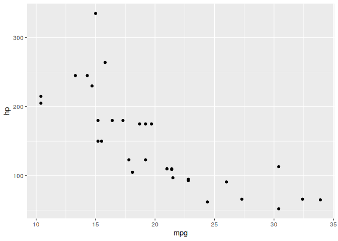

<!-- README.md is generated from README.Rmd. Please edit that file -->

# chronicler 

<!-- badges: start -->

[](https://github.com/b-rodrigues/chronicler/actions/workflows/rhub.yaml/)
[](https://app.codecov.io/gh/b-rodrigues/chronicler?branch=master)
<!-- badges: end -->

Easily add logs to your functions, without interfering with the global
environment.

## Installation

The package is available on
[CRAN](https://cran.r-project.org/package=chronicler). Install it with:

``` r
install.packages("chronicler")
```

You can install the development version from
[GitHub](https://github.com/) with:

``` r
# install.packages("devtools")
devtools::install_github("b-rodrigues/chronicler")
```

## Introduction

`{chronicler}` provides the `record()` function, which allows you to
modify functions so that they provide enhanced output. This enhanced
output consists in a detailed log, and by chaining decorated functions,
it becomes possible to have a complete trace of the operations that led
to the final output. These decorated functions work exactly the same as
their undecorated counterparts, but some care is required for correctly
handling them. This introduction will give you a quick overview of this
package’s functionality.

Let’s first start with a simple example, by decorating the `sqrt()`
function:

``` r
library(chronicler)

r_sqrt <- record(sqrt)

a <- r_sqrt(1:5)
```

Object `a` is now an object of class `chronicle`. Let’s take a closer
look at `a`:

``` r
a
#> OK! Value computed successfully:
#> ---------------
#> Just
#> [1] 1.000000 1.414214 1.732051 2.000000 2.236068
#> 
#> ---------------
#> This is an object of type `chronicle`.
#> Retrieve the value of this object with unveil(.c, "value").
#> To read the log of this object, call read_log(.c).
```

`a` is now made up of several parts. The first part:

    OK! Value computed successfully:
    ---------------
    Just
    [1] 1.000000 1.414214 1.732051 2.000000 2.236068

simply provides the result of `sqrt()` applied to `1:5` (let’s ignore
the word `Just` on the third line for now; for more details see the
`Maybe Monad` vignette). The second part tells you that there’s more to
it:

    ---------------
    This is an object of type `chronicle`.
    Retrieve the value of this object with unveil(.c, "value").
    To read the log of this object, call read_log().

The value of the `sqrt()` function applied to its arguments can be
obtained using `unveil()`, as explained:

``` r
unveil(a, "value")
#> [1] 1.000000 1.414214 1.732051 2.000000 2.236068
```

A log also gets generated and can be read using `read_log()`:

``` r
read_log(a)
#> [1] "Complete log:"                                               
#> [2] "OK! sqrt(1:5) ran successfully at 2025-08-14 18:00:21.763918"
#> [3] "Total running time: 0.000140666961669922"
```

This is especially useful for objects that get created using multiple
calls:

``` r
r_sqrt <- record(sqrt)
r_exp <- record(exp)
r_mean <- record(mean)

b <- 1:10 |>
  r_sqrt() |>
  bind_record(r_exp) |>
  bind_record(r_mean)
```

(`bind_record()` is used to chain multiple decorated functions and will
be explained in detail in the next section.)

``` r
read_log(b)
#> [1] "Complete log:"                                                                                                  
#> [2] "OK! sqrt(1:10) ran successfully at 2025-08-14 18:00:21.784513"                                                  
#> [3] "OK! exp(maybe::from_maybe(.c$value, default = maybe::nothing())) ran successfully at 2025-08-14 18:00:21.786459"
#> [4] "OK! mean(maybe::from_maybe(.c$value, default = maybe::nothing())) ran successfully at 2025-08-14 18:00:21.78825"
#> [5] "Total running time: 0.000123739242553711"

unveil(b, "value")
#> [1] 11.55345
```

`record()` works with any function, but not yet with `{ggplot2}`.

To avoid having to define every function individually, like this:

``` r
r_sqrt <- record(sqrt)
r_exp <- record(exp)
r_mean <- record(mean)
```

you can use the `record_many()` function. `record_many()` takes a list
of functions (as strings) as an input and puts generated code in your
system’s clipboard. You can then paste the code into your text editor.
The gif below illustrates how `record_many()` works:

<figure>

<figcaption aria-hidden="true"><code>record_many()</code> in
action</figcaption>
</figure>

## Chaining decorated functions

`bind_record()` is used to pass the output from one decorated function
to the next:

``` r
library(dplyr)
#> 
#> Attaching package: 'dplyr'
#> The following objects are masked from 'package:stats':
#> 
#>     filter, lag
#> The following objects are masked from 'package:base':
#> 
#>     intersect, setdiff, setequal, union
library(ggplot2)

r_group_by <- record(group_by)
r_select <- record(select)
r_summarise <- record(summarise)
r_filter <- record(filter)

output <- starwars %>%
  r_select(height, mass, species, sex) %>%
  bind_record(r_group_by, species, sex) %>%
  bind_record(r_filter, sex != "male") %>%
  bind_record(r_summarise,
              mass = mean(mass, na.rm = TRUE)
              )
```

``` r
read_log(output)
#> [1] "Complete log:"                                                                                                                 
#> [2] "OK! select(., height, mass, species, sex) ran successfully at 2025-08-14 18:00:21.808905"                                      
#> [3] "OK! group_by(maybe::from_maybe(.c$value, default = maybe::nothing()), ..1, ..2) ran successfully at 2025-08-14 18:00:21.812847"
#> [4] "OK! filter(maybe::from_maybe(.c$value, default = maybe::nothing()), ..1) ran successfully at 2025-08-14 18:00:21.816776"       
#> [5] "OK! summarise(maybe::from_maybe(.c$value, default = maybe::nothing()), ..1) ran successfully at 2025-08-14 18:00:21.820334"    
#> [6] "Total running time: 0.00961780548095703"
```

The value can then be accessed and worked on as usual using `unveil()`,
as explained above:

``` r
unveil(output, "value")
#> # A tibble: 9 × 3
#> # Groups:   species [9]
#>   species    sex              mass
#>   <chr>      <chr>           <dbl>
#> 1 Clawdite   female           55  
#> 2 Droid      none             69.8
#> 3 Human      female           56.3
#> 4 Hutt       hermaphroditic 1358  
#> 5 Kaminoan   female          NaN  
#> 6 Mirialan   female           53.1
#> 7 Tholothian female           50  
#> 8 Togruta    female           57  
#> 9 Twi'lek    female           55
```

This package also ships with a dedicated pipe, `%>=%` which you can use
instead of `bind_record()`:

``` r
output_pipe <- starwars %>%
  r_select(height, mass, species, sex) %>=%
  r_group_by(species, sex) %>=%
  r_filter(sex != "male") %>=%
  r_summarise(mean_mass = mean(mass, na.rm = TRUE))
```

``` r
unveil(output_pipe, "value")
#> # A tibble: 9 × 3
#> # Groups:   species [9]
#>   species    sex            mean_mass
#>   <chr>      <chr>              <dbl>
#> 1 Clawdite   female              55  
#> 2 Droid      none                69.8
#> 3 Human      female              56.3
#> 4 Hutt       hermaphroditic    1358  
#> 5 Kaminoan   female             NaN  
#> 6 Mirialan   female              53.1
#> 7 Tholothian female              50  
#> 8 Togruta    female              57  
#> 9 Twi'lek    female              55
```

Using the `%>=%` is not recommended in non-interactive sessions and
`bind_record()` is recommend in such settings.

## Condition handling

By default, errors and warnings get caught and composed in the log:

``` r

errord_output <- starwars %>%
  r_select(height, mass, species, sex) %>=% 
  r_group_by(species, sx) %>=% # typo, "sx" instead of "sex"
  r_filter(sex != "male") %>=%
  r_summarise(mass = mean(mass, na.rm = TRUE))
```

``` r
errord_output
#> NOK! Value computed unsuccessfully:
#> ---------------
#> Nothing
#> 
#> ---------------
#> This is an object of type `chronicle`.
#> Retrieve the value of this object with unveil(.c, "value").
#> To read the log of this object, call read_log(.c).
```

Reading the log tells you which function failed, and with which error
message:

``` r
read_log(errord_output)
#> [1] "Complete log:"                                                                                                                                                                                                                                                                                                                                                                                                                                                                                                                                                                                                                                                                                                                                                                                                                                                                                                                                                                                                                                                                                                                                                                                                                                                                                                                                                                                                                                                                                                                                                                                                                                                                                                                                                                                                                                                                                                                                                                                                                                                                                                                                                                                                                                                                                                                                                                                                                                                                                                                                                                                                                                                                                                                                                                                                                                                                                                                                                                                                                                                                                                                                                                                                                                                                                                                                                                                                                                                                                                                                                                                                                                                                                                                                                                                                                                                                                                                                                                                                                                                                                                                                                                
#> [2] "OK! select(., height, mass, species, sex) ran successfully at 2025-08-14 18:00:21.869767"                                                                                                                                                                                                                                                                                                                                                                                                                                                                                                                                                                                                                                                                                                                                                                                                                                                                                                                                                                                                                                                                                                                                                                                                                                                                                                                                                                                                                                                                                                                                                                                                                                                                                                                                                                                                                                                                                                                                                                                                                                                                                                                                                                                                                                                                                                                                                                                                                                                                                                                                                                                                                                                                                                                                                                                                                                                                                                                                                                                                                                                                                                                                                                                                                                                                                                                                                                                                                                                                                                                                                                                                                                                                                                                                                                                                                                                                                                                                                                                                                                                                                     
#> [3] "NOK! group_by(c(\"structure(list(height = c(172L, 167L, 96L, 202L, 150L, 178L, \", \"165L, 97L, 183L, 182L, 188L, 180L, 228L, 180L, 173L, 175L, 170L, \", \"180L, 66L, 170L, 183L, 200L, 190L, 177L, 175L, 180L, 150L, NA, \", \"88L, 160L, 193L, 191L, 170L, 185L, 196L, 224L, 206L, 183L, 137L, \", \"112L, 183L, 163L, 175L, 180L, 178L, 79L, 94L, 122L, 163L, 188L, \", \"198L, 196L, 171L, 184L, 188L, 264L, 188L, 196L, 185L, 157L, 183L, \", \"183L, 170L, 166L, 165L, 193L, 191L, 183L, 168L, 198L, 229L, 213L, \", \"167L, 96L, 193L, 191L, 178L, 216L, 234L, 188L, 178L, 206L, NA, \", \n\"NA, NA, NA, NA), mass = c(77, 75, 32, 136, 49, 120, 75, 32, 84, \", \"77, 84, NA, 112, 80, 74, 1358, 77, 110, 17, 75, 78.2, 140, 113, \", \"79, 79, 83, NA, NA, 20, 68, 89, 90, NA, 45, 66, 82, NA, NA, NA, \", \"40, NA, NA, 80, NA, 55, 15, 45, NA, 65, 84, 82, 87, NA, 50, NA, \", \"NA, 80, NA, 85, NA, NA, 80, 56.2, 50, NA, 80, NA, 79, 55, 102, \", \"88, NA, NA, NA, 48, NA, 57, 159, 136, 79, 48, 80, NA, NA, NA, \", \"NA, NA), species = c(\\\"Human\\\", \\\"Droid\\\", \\\"Droid\\\", \\\"Human\\\", \\\"Human\\\", \", \"\\\"Human\\\", \\\"Human\\\", \\\"Droid\\\", \\\"Human\\\", \\\"Human\\\", \\\"Human\\\", \\\"Human\\\", \", \n\"\\\"Wookiee\\\", \\\"Human\\\", \\\"Rodian\\\", \\\"Hutt\\\", \\\"Human\\\", NA, \\\"Yoda's species\\\", \", \"\\\"Human\\\", \\\"Human\\\", \\\"Droid\\\", \\\"Trandoshan\\\", \\\"Human\\\", \\\"Human\\\", \\\"Mon Calamari\\\", \", \"\\\"Human\\\", \\\"Human\\\", \\\"Ewok\\\", \\\"Sullustan\\\", \\\"Human\\\", \\\"Neimodian\\\", \", \"\\\"Human\\\", \\\"Human\\\", \\\"Gungan\\\", \\\"Gungan\\\", \\\"Gungan\\\", \\\"Human\\\", \\\"Toydarian\\\", \", \"\\\"Dug\\\", \\\"Human\\\", \\\"Human\\\", \\\"Zabrak\\\", \\\"Twi'lek\\\", \\\"Twi'lek\\\", \\\"Aleena\\\", \", \"\\\"Vulptereen\\\", \\\"Xexto\\\", \\\"Toong\\\", \\\"Human\\\", \\\"Cerean\\\", \\\"Nautolan\\\", \", \n\"\\\"Zabrak\\\", \\\"Tholothian\\\", \\\"Iktotchi\\\", \\\"Quermian\\\", \\\"Kel Dor\\\", \\\"Chagrian\\\", \", \"NA, NA, \\\"Human\\\", \\\"Geonosian\\\", \\\"Mirialan\\\", \\\"Mirialan\\\", \\\"Human\\\", \", \"\\\"Human\\\", \\\"Human\\\", \\\"Human\\\", \\\"Clawdite\\\", \\\"Besalisk\\\", \\\"Kaminoan\\\", \", \"\\\"Kaminoan\\\", \\\"Human\\\", \\\"Droid\\\", \\\"Skakoan\\\", \\\"Muun\\\", \\\"Togruta\\\", \\\"Kaleesh\\\", \", \"\\\"Wookiee\\\", \\\"Human\\\", NA, \\\"Pau'an\\\", \\\"Human\\\", \\\"Human\\\", \\\"Human\\\", \", \"\\\"Droid\\\", \\\"Human\\\"), sex = c(\\\"male\\\", \\\"none\\\", \\\"none\\\", \\\"male\\\", \\\"female\\\", \", \"\\\"male\\\", \\\"female\\\", \\\"none\\\", \\\"male\\\", \\\"male\\\", \\\"male\\\", \\\"male\\\", \\\"male\\\", \", \n\"\\\"male\\\", \\\"male\\\", \\\"hermaphroditic\\\", \\\"male\\\", NA, \\\"male\\\", \\\"male\\\", \", \"\\\"male\\\", \\\"none\\\", \\\"male\\\", \\\"male\\\", \\\"male\\\", \\\"male\\\", \\\"female\\\", \\\"male\\\", \", \"\\\"male\\\", \\\"male\\\", \\\"male\\\", \\\"male\\\", \\\"male\\\", \\\"female\\\", \\\"male\\\", \\\"male\\\", \", \"\\\"male\\\", \\\"male\\\", \\\"male\\\", \\\"male\\\", \\\"male\\\", \\\"female\\\", \\\"male\\\", \\\"male\\\", \", \"\\\"female\\\", \\\"male\\\", \\\"male\\\", \\\"male\\\", \\\"male\\\", \\\"male\\\", \\\"male\\\", \\\"male\\\", \", \"\\\"male\\\", \\\"female\\\", \\\"male\\\", \\\"male\\\", \\\"male\\\", \\\"male\\\", NA, NA, \\\"male\\\", \", \n\"\\\"male\\\", \\\"female\\\", \\\"female\\\", \\\"female\\\", \\\"male\\\", \\\"male\\\", \\\"male\\\", \", \"\\\"female\\\", \\\"male\\\", \\\"male\\\", \\\"female\\\", \\\"female\\\", \\\"none\\\", \\\"male\\\", \", \"\\\"male\\\", \\\"female\\\", \\\"male\\\", \\\"male\\\", \\\"male\\\", NA, \\\"male\\\", \\\"male\\\", \", \"\\\"female\\\", \\\"male\\\", \\\"none\\\", \\\"female\\\")), row.names = c(NA, -87L), class = c(\\\"tbl_df\\\", \", \"\\\"tbl\\\", \\\"data.frame\\\"))\"), species, sx) ran unsuccessfully with following exception: Must group by variables found in `.data`.\n✖ Column `sx` is not found. at 2025-08-14 18:00:21.872748"
#> [4] "NOK! filter(structure(list(type = \"nothing\"), class = \"maybe\"), sex != \"male\") ran unsuccessfully with following exception: Pipeline failed upstream at 2025-08-14 18:00:21.900819"                                                                                                                                                                                                                                                                                                                                                                                                                                                                                                                                                                                                                                                                                                                                                                                                                                                                                                                                                                                                                                                                                                                                                                                                                                                                                                                                                                                                                                                                                                                                                                                                                                                                                                                                                                                                                                                                                                                                                                                                                                                                                                                                                                                                                                                                                                                                                                                                                                                                                                                                                                                                                                                                                                                                                                                                                                                                                                                                                                                                                                                                                                                                                                                                                                                                                                                                                                                                                                                                                                                                                                                                                                                                                                                                                                                                                                                                                                                                                                                     
#> [5] "NOK! summarise(structure(list(type = \"nothing\"), class = \"maybe\"), mean(mass, na.rm = TRUE)) ran unsuccessfully with following exception: Pipeline failed upstream at 2025-08-14 18:00:21.902674"                                                                                                                                                                                                                                                                                                                                                                                                                                                                                                                                                                                                                                                                                                                                                                                                                                                                                                                                                                                                                                                                                                                                                                                                                                                                                                                                                                                                                                                                                                                                                                                                                                                                                                                                                                                                                                                                                                                                                                                                                                                                                                                                                                                                                                                                                                                                                                                                                                                                                                                                                                                                                                                                                                                                                                                                                                                                                                                                                                                                                                                                                                                                                                                                                                                                                                                                                                                                                                                                                                                                                                                                                                                                                                                                                                                                                                                                                                                                                                         
#> [6] "Total running time: 0.0243434906005859"
```

It is also possible to only capture errors, or capture errors, warnings
and messages using the `strict` parameter of `record()`

``` r
# Only errors:

r_sqrt <- record(sqrt, strict = 1)

r_sqrt(-10) |>
  read_log()
#> Warning in .f(.value, ...): NaNs produced
#> [1] "Complete log:"                                               
#> [2] "OK! sqrt(-10) ran successfully at 2025-08-14 18:00:21.916445"
#> [3] "Total running time: 0.000190973281860352"

# Errors and warnings:

r_sqrt <- record(sqrt, strict = 2)

r_sqrt(-10) |>
  read_log()
#> [1] "Complete log:"                                                                                         
#> [2] "NOK! sqrt(-10) ran unsuccessfully with following exception: NaNs produced at 2025-08-14 18:00:21.91918"
#> [3] "Total running time: 9.70363616943359e-05"

# Errors, warnings and messages

my_f <- function(x){
  message("this is a message")
  10
}

record(my_f, strict = 3)(10) |>
                         read_log()
#> [1] "Complete log:"                                                                                               
#> [2] "NOK! my_f(10) ran unsuccessfully with following exception: this is a message\n at 2025-08-14 18:00:21.921752"
#> [3] "Total running time: 0.000112295150756836"
```

## Advanced logging

You can provide a function to `record()`, which will be evaluated on the
output. This makes it possible to, for example, monitor the size of a
data frame throughout the pipeline:

``` r
r_group_by <- record(group_by)
r_select <- record(select, .g = dim)
r_summarise <- record(summarise, .g = dim)
r_filter <- record(filter, .g = dim)

output_pipe <- starwars %>%
  r_select(height, mass, species, sex) %>=%
  r_group_by(species, sex) %>=%
  r_filter(sex != "male") %>=%
  r_summarise(mass = mean(mass, na.rm = TRUE))
```

The `$log_df` element of a `chronicle` object contains detailed
information:

``` r
unveil(output_pipe, "log_df")
#>   ops_number     outcome  function
#> 1          1 OK! Success    select
#> 2          2 OK! Success  group_by
#> 3          3 OK! Success    filter
#> 4          4 OK! Success summarise
#>                                                                                                                                                                                                                                                                                                                                                                                                                                                                                                                                                                                                                                                                                                                                                                                                                                                                                                                                                                                                                                                                                                                                                                                                                                                                                                                                                                                                                                                                                                                                                                                                                                                                                                                                                                                                                                                                                                                                                                                                                                                                                                                                                                                                                                                                                                                                                                                                                                                                                                                                                                                                                                                                                                                                                                                                                                                                                                                                                                                                                                                                                                                                                                                                                                                                                                                                                                                                                                                                                                                                                                                                                                                                                                                                                                                                                                                                                                                                                                                                                                                                                                                                                                                                                                                                                                                                                                                                                                                                                                                                                                                                                                                                                                                                                                                                                                                                                                                                                                                                                                                                                                                                                                                                                                                                                                                                                                                                                                                                                                                                                                                                                                                                                                      arguments
#> 1                                                                                                                                                                                                                                                                                                                                                                                                                                                                                                                                                                                                                                                                                                                                                                                                                                                                                                                                                                                                                                                                                                                                                                                                                                                                                                                                                                                                                                                                                                                                                                                                                                                                                                                                                                                                                                                                                                                                                                                                                                                                                                                                                                                                                                                                                                                                                                                                                                                                                                                                                                                                                                                                                                                                                                                                                                                                                                                                                                                                                                                                                                                                                                                                                                                                                                                                                                                                                                                                                                                                                                                                                                                                                                                                                                                                                                                                                                                                                                                                                                                                                                                                                                                                                                                                                                                                                                                                                                                                                                                                                                                                                                                                                                                                                                                                                                                                                                                                                                                                                                                                                                                                                                                                                                                                                                                                                                                                                                                                                                                                                                                                                                                                                ., height, mass, species, sex
#> 2                                                                                                                                                                                                                                                                                                                                                                                                                                                                                                                                                                                                                                                                                                                                                                                                                                                                                                                                                                                                                                                                                                                                                                                                                                                                                                                                                                                                                                                                                                                                                                                                                                                                                                                                                                                                                                                                                                                                                                                                                                                                                                                                  c("structure(list(height = c(172L, 167L, 96L, 202L, 150L, 178L, ", "165L, 97L, 183L, 182L, 188L, 180L, 228L, 180L, 173L, 175L, 170L, ", "180L, 66L, 170L, 183L, 200L, 190L, 177L, 175L, 180L, 150L, NA, ", "88L, 160L, 193L, 191L, 170L, 185L, 196L, 224L, 206L, 183L, 137L, ", "112L, 183L, 163L, 175L, 180L, 178L, 79L, 94L, 122L, 163L, 188L, ", "198L, 196L, 171L, 184L, 188L, 264L, 188L, 196L, 185L, 157L, 183L, ", "183L, 170L, 166L, 165L, 193L, 191L, 183L, 168L, 198L, 229L, 213L, ", "167L, 96L, 193L, 191L, 178L, 216L, 234L, 188L, 178L, 206L, NA, ", \n"NA, NA, NA, NA), mass = c(77, 75, 32, 136, 49, 120, 75, 32, 84, ", "77, 84, NA, 112, 80, 74, 1358, 77, 110, 17, 75, 78.2, 140, 113, ", "79, 79, 83, NA, NA, 20, 68, 89, 90, NA, 45, 66, 82, NA, NA, NA, ", "40, NA, NA, 80, NA, 55, 15, 45, NA, 65, 84, 82, 87, NA, 50, NA, ", "NA, 80, NA, 85, NA, NA, 80, 56.2, 50, NA, 80, NA, 79, 55, 102, ", "88, NA, NA, NA, 48, NA, 57, 159, 136, 79, 48, 80, NA, NA, NA, ", "NA, NA), species = c(\\"Human\\", \\"Droid\\", \\"Droid\\", \\"Human\\", \\"Human\\", ", "\\"Human\\", \\"Human\\", \\"Droid\\", \\"Human\\", \\"Human\\", \\"Human\\", \\"Human\\", ", \n"\\"Wookiee\\", \\"Human\\", \\"Rodian\\", \\"Hutt\\", \\"Human\\", NA, \\"Yoda's species\\", ", "\\"Human\\", \\"Human\\", \\"Droid\\", \\"Trandoshan\\", \\"Human\\", \\"Human\\", \\"Mon Calamari\\", ", "\\"Human\\", \\"Human\\", \\"Ewok\\", \\"Sullustan\\", \\"Human\\", \\"Neimodian\\", ", "\\"Human\\", \\"Human\\", \\"Gungan\\", \\"Gungan\\", \\"Gungan\\", \\"Human\\", \\"Toydarian\\", ", "\\"Dug\\", \\"Human\\", \\"Human\\", \\"Zabrak\\", \\"Twi'lek\\", \\"Twi'lek\\", \\"Aleena\\", ", "\\"Vulptereen\\", \\"Xexto\\", \\"Toong\\", \\"Human\\", \\"Cerean\\", \\"Nautolan\\", ", \n"\\"Zabrak\\", \\"Tholothian\\", \\"Iktotchi\\", \\"Quermian\\", \\"Kel Dor\\", \\"Chagrian\\", ", "NA, NA, \\"Human\\", \\"Geonosian\\", \\"Mirialan\\", \\"Mirialan\\", \\"Human\\", ", "\\"Human\\", \\"Human\\", \\"Human\\", \\"Clawdite\\", \\"Besalisk\\", \\"Kaminoan\\", ", "\\"Kaminoan\\", \\"Human\\", \\"Droid\\", \\"Skakoan\\", \\"Muun\\", \\"Togruta\\", \\"Kaleesh\\", ", "\\"Wookiee\\", \\"Human\\", NA, \\"Pau'an\\", \\"Human\\", \\"Human\\", \\"Human\\", ", "\\"Droid\\", \\"Human\\"), sex = c(\\"male\\", \\"none\\", \\"none\\", \\"male\\", \\"female\\", ", "\\"male\\", \\"female\\", \\"none\\", \\"male\\", \\"male\\", \\"male\\", \\"male\\", \\"male\\", ", \n"\\"male\\", \\"male\\", \\"hermaphroditic\\", \\"male\\", NA, \\"male\\", \\"male\\", ", "\\"male\\", \\"none\\", \\"male\\", \\"male\\", \\"male\\", \\"male\\", \\"female\\", \\"male\\", ", "\\"male\\", \\"male\\", \\"male\\", \\"male\\", \\"male\\", \\"female\\", \\"male\\", \\"male\\", ", "\\"male\\", \\"male\\", \\"male\\", \\"male\\", \\"male\\", \\"female\\", \\"male\\", \\"male\\", ", "\\"female\\", \\"male\\", \\"male\\", \\"male\\", \\"male\\", \\"male\\", \\"male\\", \\"male\\", ", "\\"male\\", \\"female\\", \\"male\\", \\"male\\", \\"male\\", \\"male\\", NA, NA, \\"male\\", ", \n"\\"male\\", \\"female\\", \\"female\\", \\"female\\", \\"male\\", \\"male\\", \\"male\\", ", "\\"female\\", \\"male\\", \\"male\\", \\"female\\", \\"female\\", \\"none\\", \\"male\\", ", "\\"male\\", \\"female\\", \\"male\\", \\"male\\", \\"male\\", NA, \\"male\\", \\"male\\", ", "\\"female\\", \\"male\\", \\"none\\", \\"female\\")), row.names = c(NA, -87L), class = c(\\"tbl_df\\", ", "\\"tbl\\", \\"data.frame\\"))"), species, sex
#> 3 c("structure(list(height = c(172L, 167L, 96L, 202L, 150L, 178L, ", "165L, 97L, 183L, 182L, 188L, 180L, 228L, 180L, 173L, 175L, 170L, ", "180L, 66L, 170L, 183L, 200L, 190L, 177L, 175L, 180L, 150L, NA, ", "88L, 160L, 193L, 191L, 170L, 185L, 196L, 224L, 206L, 183L, 137L, ", "112L, 183L, 163L, 175L, 180L, 178L, 79L, 94L, 122L, 163L, 188L, ", "198L, 196L, 171L, 184L, 188L, 264L, 188L, 196L, 185L, 157L, 183L, ", "183L, 170L, 166L, 165L, 193L, 191L, 183L, 168L, 198L, 229L, 213L, ", "167L, 96L, 193L, 191L, 178L, 216L, 234L, 188L, 178L, 206L, NA, ", \n"NA, NA, NA, NA), mass = c(77, 75, 32, 136, 49, 120, 75, 32, 84, ", "77, 84, NA, 112, 80, 74, 1358, 77, 110, 17, 75, 78.2, 140, 113, ", "79, 79, 83, NA, NA, 20, 68, 89, 90, NA, 45, 66, 82, NA, NA, NA, ", "40, NA, NA, 80, NA, 55, 15, 45, NA, 65, 84, 82, 87, NA, 50, NA, ", "NA, 80, NA, 85, NA, NA, 80, 56.2, 50, NA, 80, NA, 79, 55, 102, ", "88, NA, NA, NA, 48, NA, 57, 159, 136, 79, 48, 80, NA, NA, NA, ", "NA, NA), species = c(\\"Human\\", \\"Droid\\", \\"Droid\\", \\"Human\\", \\"Human\\", ", "\\"Human\\", \\"Human\\", \\"Droid\\", \\"Human\\", \\"Human\\", \\"Human\\", \\"Human\\", ", \n"\\"Wookiee\\", \\"Human\\", \\"Rodian\\", \\"Hutt\\", \\"Human\\", NA, \\"Yoda's species\\", ", "\\"Human\\", \\"Human\\", \\"Droid\\", \\"Trandoshan\\", \\"Human\\", \\"Human\\", \\"Mon Calamari\\", ", "\\"Human\\", \\"Human\\", \\"Ewok\\", \\"Sullustan\\", \\"Human\\", \\"Neimodian\\", ", "\\"Human\\", \\"Human\\", \\"Gungan\\", \\"Gungan\\", \\"Gungan\\", \\"Human\\", \\"Toydarian\\", ", "\\"Dug\\", \\"Human\\", \\"Human\\", \\"Zabrak\\", \\"Twi'lek\\", \\"Twi'lek\\", \\"Aleena\\", ", "\\"Vulptereen\\", \\"Xexto\\", \\"Toong\\", \\"Human\\", \\"Cerean\\", \\"Nautolan\\", ", \n"\\"Zabrak\\", \\"Tholothian\\", \\"Iktotchi\\", \\"Quermian\\", \\"Kel Dor\\", \\"Chagrian\\", ", "NA, NA, \\"Human\\", \\"Geonosian\\", \\"Mirialan\\", \\"Mirialan\\", \\"Human\\", ", "\\"Human\\", \\"Human\\", \\"Human\\", \\"Clawdite\\", \\"Besalisk\\", \\"Kaminoan\\", ", "\\"Kaminoan\\", \\"Human\\", \\"Droid\\", \\"Skakoan\\", \\"Muun\\", \\"Togruta\\", \\"Kaleesh\\", ", "\\"Wookiee\\", \\"Human\\", NA, \\"Pau'an\\", \\"Human\\", \\"Human\\", \\"Human\\", ", "\\"Droid\\", \\"Human\\"), sex = c(\\"male\\", \\"none\\", \\"none\\", \\"male\\", \\"female\\", ", "\\"male\\", \\"female\\", \\"none\\", \\"male\\", \\"male\\", \\"male\\", \\"male\\", \\"male\\", ", \n"\\"male\\", \\"male\\", \\"hermaphroditic\\", \\"male\\", NA, \\"male\\", \\"male\\", ", "\\"male\\", \\"none\\", \\"male\\", \\"male\\", \\"male\\", \\"male\\", \\"female\\", \\"male\\", ", "\\"male\\", \\"male\\", \\"male\\", \\"male\\", \\"male\\", \\"female\\", \\"male\\", \\"male\\", ", "\\"male\\", \\"male\\", \\"male\\", \\"male\\", \\"male\\", \\"female\\", \\"male\\", \\"male\\", ", "\\"female\\", \\"male\\", \\"male\\", \\"male\\", \\"male\\", \\"male\\", \\"male\\", \\"male\\", ", "\\"male\\", \\"female\\", \\"male\\", \\"male\\", \\"male\\", \\"male\\", NA, NA, \\"male\\", ", \n"\\"male\\", \\"female\\", \\"female\\", \\"female\\", \\"male\\", \\"male\\", \\"male\\", ", "\\"female\\", \\"male\\", \\"male\\", \\"female\\", \\"female\\", \\"none\\", \\"male\\", ", "\\"male\\", \\"female\\", \\"male\\", \\"male\\", \\"male\\", NA, \\"male\\", \\"male\\", ", "\\"female\\", \\"male\\", \\"none\\", \\"female\\")), class = c(\\"grouped_df\\", ", "\\"tbl_df\\", \\"tbl\\", \\"data.frame\\"), row.names = c(NA, -87L), groups = structure(list(", "    species = c(\\"Aleena\\", \\"Besalisk\\", \\"Cerean\\", \\"Chagrian\\", \\"Clawdite\\", ", "    \\"Droid\\", \\"Dug\\", \\"Ewok\\", \\"Geonosian\\", \\"Gungan\\", \\"Human\\", \\"Human\\", ", \n"    \\"Hutt\\", \\"Iktotchi\\", \\"Kaleesh\\", \\"Kaminoan\\", \\"Kaminoan\\", \\"Kel Dor\\", ", "    \\"Mirialan\\", \\"Mon Calamari\\", \\"Muun\\", \\"Nautolan\\", \\"Neimodian\\", ", "    \\"Pau'an\\", \\"Quermian\\", \\"Rodian\\", \\"Skakoan\\", \\"Sullustan\\", \\"Tholothian\\", ", "    \\"Togruta\\", \\"Toong\\", \\"Toydarian\\", \\"Trandoshan\\", \\"Twi'lek\\", ", "    \\"Twi'lek\\", \\"Vulptereen\\", \\"Wookiee\\", \\"Xexto\\", \\"Yoda's species\\", ", "    \\"Zabrak\\", NA), sex = c(\\"male\\", \\"male\\", \\"male\\", \\"male\\", \\"female\\", ", "    \\"none\\", \\"male\\", \\"male\\", \\"male\\", \\"male\\", \\"female\\", \\"male\\", ", \n"    \\"hermaphroditic\\", \\"male\\", \\"male\\", \\"female\\", \\"male\\", \\"male\\", ", "    \\"female\\", \\"male\\", \\"male\\", \\"male\\", \\"male\\", \\"male\\", \\"male\\", ", "    \\"male\\", \\"male\\", \\"male\\", \\"female\\", \\"female\\", \\"male\\", \\"male\\", ", "    \\"male\\", \\"female\\", \\"male\\", \\"male\\", \\"male\\", \\"male\\", \\"male\\", ", "    \\"male\\", NA), .rows = structure(list(46L, 70L, 51L, 58L, 69L, ", "        c(2L, 3L, 8L, 22L, 74L, 86L), 40L, 29L, 62L, 35:37, c(5L, ", "        7L, 27L, 34L, 42L, 65L, 73L, 84L, 87L), c(1L, 4L, 6L, ", \n"        9L, 10L, 11L, 12L, 14L, 17L, 20L, 21L, 24L, 25L, 28L, ", "        31L, 33L, 38L, 41L, 50L, 61L, 66L, 67L, 68L, 80L, 83L, ", "        85L), 16L, 55L, 78L, 72L, 71L, 57L, 63:64, 26L, 76L, ", "        52L, 32L, 82L, 56L, 15L, 75L, 30L, 54L, 77L, 49L, 39L, ", "        23L, 45L, 44L, 47L, c(13L, 79L), 48L, 19L, c(43L, 53L", "        ), c(18L, 59L, 60L, 81L)), ptype = integer(0), class = c(\\"vctrs_list_of\\", ", "    \\"vctrs_vctr\\", \\"list\\"))), class = c(\\"tbl_df\\", \\"tbl\\", \\"data.frame\\"", "), row.names = c(NA, -41L), .drop = TRUE))"\n), sex != "male"
#> 4                                                                                                                                                                                                                                                                                                                                                                                                                                                                                                                                                                                                                                                                                                                                                                                                                                                                                                                                                                                                                                                                                                                                                                                                                                                                                                                                                                                                                                                                                                                                                                                                                                                                                                                                                                                                                                                                                                                                                                                                                                                                                                                                                                                                                                                                                                                                                                                                                                                                                                                                                                                                                                                                                                                                                                                                                                                                                                                                                                                                                                                                                                                                                                                                                                                                                                                                                                                                                                                                                                                                                                                                                                                                                                                                                                                                                                                   c("structure(list(height = c(167L, 96L, 150L, 165L, 97L, 175L, 200L, ", "150L, 185L, 163L, 178L, 184L, 170L, 166L, 165L, 168L, 213L, 167L, ", "96L, 178L, NA, NA, NA), mass = c(75, 32, 49, 75, 32, 1358, 140, ", "NA, 45, NA, 55, 50, 56.2, 50, NA, 55, NA, NA, NA, 57, NA, NA, ", "NA), species = c(\\"Droid\\", \\"Droid\\", \\"Human\\", \\"Human\\", \\"Droid\\", ", "\\"Hutt\\", \\"Droid\\", \\"Human\\", \\"Human\\", \\"Human\\", \\"Twi'lek\\", \\"Tholothian\\", ", "\\"Mirialan\\", \\"Mirialan\\", \\"Human\\", \\"Clawdite\\", \\"Kaminoan\\", \\"Human\\", ", \n"\\"Droid\\", \\"Togruta\\", \\"Human\\", \\"Droid\\", \\"Human\\"), sex = c(\\"none\\", ", "\\"none\\", \\"female\\", \\"female\\", \\"none\\", \\"hermaphroditic\\", \\"none\\", ", "\\"female\\", \\"female\\", \\"female\\", \\"female\\", \\"female\\", \\"female\\", \\"female\\", ", "\\"female\\", \\"female\\", \\"female\\", \\"female\\", \\"none\\", \\"female\\", \\"female\\", ", "\\"none\\", \\"female\\")), class = c(\\"grouped_df\\", \\"tbl_df\\", \\"tbl\\", ", "\\"data.frame\\"), row.names = c(NA, -23L), groups = structure(list(", "    species = c(\\"Clawdite\\", \\"Droid\\", \\"Human\\", \\"Hutt\\", \\"Kaminoan\\", ", \n"    \\"Mirialan\\", \\"Tholothian\\", \\"Togruta\\", \\"Twi'lek\\"), sex = c(\\"female\\", ", "    \\"none\\", \\"female\\", \\"hermaphroditic\\", \\"female\\", \\"female\\", \\"female\\", ", "    \\"female\\", \\"female\\"), .rows = structure(list(16L, c(1L, 2L, ", "    5L, 7L, 19L, 22L), c(3L, 4L, 8L, 9L, 10L, 15L, 18L, 21L, ", "    23L), 6L, 17L, 13:14, 12L, 20L, 11L), ptype = integer(0), class = c(\\"vctrs_list_of\\", ", "    \\"vctrs_vctr\\", \\"list\\"))), row.names = c(NA, -9L), .drop = TRUE, class = c(\\"tbl_df\\", ", "\\"tbl\\", \\"data.frame\\")))"\n), mean(mass, na.rm = TRUE)
#>   message          start_time            end_time          run_time     g
#> 1      NA 2025-08-14 18:00:21 2025-08-14 18:00:21 0.0007340908 secs 87, 4
#> 2      NA 2025-08-14 18:00:21 2025-08-14 18:00:21 0.0009417534 secs    NA
#> 3      NA 2025-08-14 18:00:21 2025-08-14 18:00:21 0.0008695126 secs 23, 4
#> 4      NA 2025-08-14 18:00:21 2025-08-14 18:00:21 0.0011363029 secs  9, 3
#>   diff_obj lag_outcome
#> 1     NULL        <NA>
#> 2     NULL OK! Success
#> 3     NULL OK! Success
#> 4     NULL OK! Success
```

It is thus possible to take a look at the output of the function
provided (`dim()`) using `check_g()`:

``` r
check_g(output_pipe)
#>   ops_number  function     g
#> 1          1    select 87, 4
#> 2          2  group_by    NA
#> 3          3    filter 23, 4
#> 4          4 summarise  9, 3
```

We can see that the dimension of the dataframe was (87, 4) after the
call to `select()`, (23, 4) after the call to `filter()` and finally (9,
3) after the call to `summarise()`.

Another possibility for advanced logging is to use the `diff` argument
in record, which defaults to “none”. Setting it to “full” provides, at
each step of a workflow, the diff between the input and the output:

``` r
r_group_by <- record(group_by)
r_select <- record(select, diff = "full")
r_summarise <- record(summarise, diff = "full")
r_filter <- record(filter, diff = "full")

output_pipe <- starwars %>%
  r_select(height, mass, species, sex) %>=%
  r_group_by(species, sex) %>=%
  r_filter(sex != "male") %>=%
  r_summarise(mass = mean(mass, na.rm = TRUE))
```

Let’s compare the input and the output to `r_filter(sex != "male")`:

``` r
# The following line generates a data frame with columns `ops_number`, `function` and `diff_obj`
# it is possible to filter on the step of interest using the `ops_number` or the `function` column
diff_pipe <- check_diff(output_pipe)

diff_pipe %>%
  filter(`function` == "filter") %>%  # <- backticks around `function` are required
  pull(diff_obj)
#> [[1]]
#> < input                                 
#> > output                                
#> @@ 1,15 / 1,15 @@                       
#> < # A tibble: 87 × 4                    
#> > # A tibble: 23 × 4                    
#> < # Groups:   species, sex [41]         
#> > # Groups:   species, sex [9]          
#>      height  mass species sex           
#>       <int> <dbl> <chr>   <chr>         
#> <  1    172    77 Human   male          
#>    2    167    75 Droid   none          
#>    3     96    32 Droid   none          
#> <  4    202   136 Human   male          
#>    5    150    49 Human   female        
#> <  6    178   120 Human   male          
#>    7    165    75 Human   female        
#>    8     97    32 Droid   none          
#> >  6    175  1358 Hutt    hermaphroditic
#> >  7    200   140 Droid   none          
#> <  9    183    84 Human   male          
#> >  8    150    NA Human   female        
#> < 10    182    77 Human   male          
#> >  9    185    45 Human   female        
#> > 10    163    NA Human   female        
#> < # ℹ 77 more rows                      
#> > # ℹ 13 more rows
```

If you are familiar with the version control software `Git`, you should
have no problem reading this output. The input was a data frame of 87
rows and 4 columns, and the output only had 23 rows. Rows that were in
the input, and got removed from the output, are highlighted (in the
terminal, but not here, due to the color scheme). If `diff` is set to
“summary”, then only a summary is provided:

``` r
r_group_by <- record(group_by)
r_select <- record(select, diff = "summary")
r_summarise <- record(summarise, diff = "summary")
r_filter <- record(filter, diff = "summary")

output_pipe <- starwars %>%
  r_select(height, mass, species, sex) %>=%
  r_group_by(species, sex) %>=%
  r_filter(sex != "male") %>=%
  r_summarise(mass = mean(mass, na.rm = TRUE))

diff_pipe <- check_diff(output_pipe)

diff_pipe %>%
  filter(`function` == "filter") %>%  # <- backticks around `function` are required
  pull(diff_obj)
#> [[1]]
#> 
#> Found differences in 5 hunks:
#>   8 insertions, 8 deletions, 7 matches (lines)
#> 
#> Diff map (line:char scale is 1:1 for single chars, 1:1 for char seqs):
#>   DDII..D..D.D..DDDIIIIII
```

By combining `.g` and `diff`, it is possible to have a very clear
overview of what happened to the very first input throughout the
pipeline. `diff` functionality is provided by the `{diffobj}` package.

## Recording ggplot

This package provides a `record()` implementation for `{ggplot2}` called
`record_ggplot()`. It is a separate function for two main reasons:

- ggplot specifications are composed of multiple function calls.
- ggplot specifications are lazily evaluated, meaning that errors aren’t
  thrown immediately. For example:

``` r
# Notice the double "g" in "mpgg" 
plot_1 <- ggplot(data = mtcars) + geom_point(aes(y = hp, x = mpgg))
# The error is not thrown here due to ggplot's lazy evaluation
```

The error will only be thrown when you force evaluation, for example by
printing `plot_1`.

The function `record_ggplot()` takes the ggplot specification as the
first argument. It can also take the `strict` argument mentioned above.

``` r
r_plot_1 <- record_ggplot(ggplot(data = mtcars) + geom_point(aes(y = hp, x = mpg)))
```

The output of this function is the same as for `record()`:

``` r
unveil(r_plot_1, "value")
```



``` r
read_log(r_plot_1)
#> [1] "Complete log:"                                                                                                
#> [2] "OK! ggplot(data = mtcars) + geom_point(aes(y = hp, x = mpg))() ran successfully at 2025-08-14 18:00:22.520489"
#> [3] "Total running time: 0.06168532371521"
```

## Thanks

I’d like to thank [armcn](https://github.com/armcn),
[Kupac](https://github.com/Kupac) for their blog posts
([here](https://www.biobits.be/biofunctor/2019/05/25/maybe-monad-in-r/))
and packages ([maybe](https://armcn.github.io/maybe/)) which inspired me
to build this package. Thank you as well to
[TimTeaFan](https://forum.posit.co/t/help-with-writing-a-custom-pipe-and-environments/133447/2?u=brodriguesco)
for his help with writing the `%>=%` infix operator,
[nigrahamuk](https://forum.posit.co/t/best-way-to-catch-rlang-errors-consistently/131632/5?u=brodriguesco)
for showing me a nice way to catch errors, and finally
[Mwavu](https://forum.posit.co/t/how-to-do-call-a-dplyr-function/131396/2?u=brodriguesco)
for pointing me towards the right direction with an issue I’ve had as I
started working on this package. Thanks to
[Putosaure](https://x.com/putosaure) for designing the hex logo.
